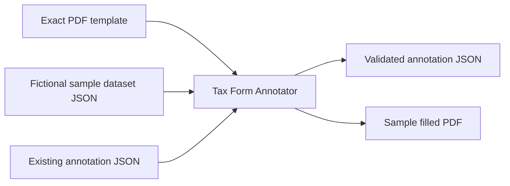
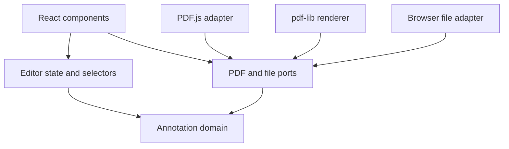

# Tax Form Annotator Architecture

Status: Draft 1.0  
Related contract: [`specification.md`](./specification.md)

## 1. Purpose

This document describes how the Tax Form Annotator application will be built. The application helps a human author create, verify, preview, and export an annotation document for an exact U.S. tax-form PDF.

The architecture supports this workflow:

```text
Load PDF template
        |
        v
Import AcroForm fields when available ----+
                                           +--> Apply verified profile when available
Draw or correct rectangles manually -------+                 |
                                                             v
                                              Review mappings and exclude unused fields
                                                        |
                                                        v
                                              Preview with sample data
                                                        |
                                                        v
                                               Validate and export JSON
                                                        |
                                                        v
                                             Generate sample filled PDF
```

The application is an annotation authoring and demonstration tool. It does not calculate tax, file a return with the IRS, or infer taxpayer values.

## 2. Architecture goals

The architecture prioritizes:

- One canonical annotation state shared by import, editing, preview, and export.
- Pure, testable domain rules that do not depend on React or a PDF library.
- Exact template identification through tax year, page metadata, and SHA-256 checksum.
- Conservative profile-based mapping that never overwrites manual or partially completed mappings.
- Resolution-independent positioning with normalized, top-left coordinates.
- Explicit incomplete states while editing and strict validation at export.
- Local processing so fictional or sensitive sample data does not leave the browser.
- Replaceable PDF-library adapters so library details do not leak into the domain.
- A small implementation suitable for an engineering assignment.

## 3. Technology choices

The proposed implementation is a client-side web application.

| Concern | Choice | Reason |
|---|---|---|
| Language | TypeScript | Makes the annotation contract and incomplete draft states explicit. |
| UI | React | Fits the component-oriented editor layout and existing project structure. |
| Build tool | Vite | Provides a small, fast development and production build setup. |
| PDF display and widget inspection | PDF.js (`pdfjs-dist`) | Renders PDF pages in the browser and exposes AcroForm widget annotations. |
| PDF output | `pdf-lib` | Loads the original PDF and draws the resolved values into a downloadable copy. |
| JSON Schema validation | Ajv 2020 | Validates exported annotation documents against JSON Schema 2020-12. |
| Unit and integration tests | Vitest | Integrates cleanly with TypeScript and Vite. |
| Component tests | React Testing Library | Tests behavior through the interface presented to a user. |

Library-specific values and objects are contained inside adapters. Domain modules receive plain TypeScript values.

The first version has no backend, database, authentication, or cloud storage.

## 4. System context

The authoring application consumes three file types and produces two artifacts.



Inputs:

- The exact blank PDF template.
- Optional existing annotation JSON for continued editing.
- Fictional sample taxpayer data for pointer checks and preview.

Outputs:

- Annotation JSON conforming to `annotation.schema.json` and `specification.md`.
- A sample completed PDF demonstrating that values fit the annotated boxes.

The annotation JSON is the primary deliverable. The filled PDF is evidence that the contract can be consumed correctly.

## 5. Layered design

Dependencies point inward toward the domain layer.



### 5.1 Domain layer

The domain layer owns plain serializable types and deterministic rules:

- Annotation and draft-field types.
- JSON Pointer resolution.
- Value type checking and formatting.
- Screen, normalized, and PDF coordinate conversion.
- Default style and behavior inheritance.
- Schema-independent semantic validation.
- Structured diagnostics.

It MUST NOT import React, PDF.js, `pdf-lib`, DOM types, or browser file APIs.

### 5.2 State layer

The state layer owns editor transitions and derived selectors:

- Template-load state.
- The canonical draft annotation.
- Current page, tool, selection, and zoom.
- Sample dataset metadata.
- Validation results and dirty state.

All writes flow through reducer actions. Preview and export consume selectors over the same state instead of maintaining copied field arrays.

### 5.3 PDF layer

The PDF layer translates between external PDF conventions and domain values:

- Load and render pages with PDF.js.
- Discover AcroForm widget annotations.
- Convert imported widget rectangles to normalized top-left boxes.
- Generate a sample filled PDF with `pdf-lib`.
- Convert library failures into project diagnostics.

PDF.js and `pdf-lib` objects MUST NOT be stored in exported annotation data.

### 5.4 I/O layer

The I/O layer owns browser file operations:

- Read PDF and JSON files.
- Parse annotation and dataset JSON.
- Calculate the PDF SHA-256 checksum with the Web Crypto API.
- Serialize annotation JSON deterministically.
- Download annotation JSON and filled PDF files.

### 5.5 Presentation layer

React components display state and dispatch user intent. Components do not implement coordinate formulas, JSON Pointer parsing, field formatting, or export validation.

## 6. Canonical editor state

The editor uses one state model for the importer, manual editor, preview renderer, and exporter.

The following TypeScript describes the architectural shape. The final source types may split these declarations across focused files.

```ts
type EditorState = {
  template: TemplateSession | null;
  templateLoad: TemplateLoadState;
  draft: AnnotationDraft;
  sampleDataset: SampleDatasetState;
  ui: EditorUiState;
  diagnostics: Diagnostic[];
  isDirty: boolean;
};

type TemplateLoadState = {
  status: "idle" | "loading" | "ready" | "error";
  errorMessage: string | null;
};

type TemplateSession = {
  fileName: string;
  bytes: Uint8Array;
  sha256: string;
  pages: PageMetadata[];
};

type SampleDatasetState = {
  status: "idle" | "loading" | "ready" | "error";
  session: {
    fileName: string;
    value: JsonValue;
  } | null;
  errorMessage: string | null;
};

type PageMetadata = {
  pageNumber: number;
  widthPt: number;
  heightPt: number;
  rotationDegrees: number;
};

type AnnotationDraft = {
  annotationVersion: "1.0";
  form: DraftFormMetadata;
  dataContract: DataContract;
  coordinateSystem: CoordinateSystem;
  defaults: AnnotationDefaults;
  fields: DraftFieldAnnotation[];
};

type DraftFieldAnnotation = {
  draftId: string;
  origin: "acroform" | "manual" | "imported-json";
  originalPdfFieldName?: string;
  sourceFieldKind?: "text" | "checkbox" | "radio" | "choice" | "signature" | "button" | "unknown";
  mappingStatus: "unmapped" | "mapped" | "invalid";
  id?: string;
  label?: string;
  description?: string;
  page: number;
  source?: ValueSource;
  box: NormalizedBox;
  format?: FieldFormat;
  style?: Partial<FieldStyle>;
  behavior?: Partial<FieldBehavior>;
};

type EditorUiState = {
  currentPage: number;
  zoom: number;
  activeTool: "select" | "draw";
  selectedDraftId: string | null;
  pendingSelection: ScreenBox | null;
  pendingFieldTransform: {
    draftId: string;
    box: NormalizedBox;
  } | null;
  previewEnabled: boolean;
  showDetectedFields: boolean;
};
```

`JsonValue`, annotation properties, field-format unions, and behavior types mirror the public specification.

### 6.1 Why draft fields allow missing properties

An imported PDF widget provides a page and rectangle, but its PDF field name is not a reliable semantic ID or dataset mapping. Manual drawing also creates a rectangle before the author completes its mapping. The editor therefore represents incompleteness honestly with optional draft properties and `mappingStatus`.

The exported `FieldAnnotation` type is separate and strict. It requires every property defined as required by the specification.

### 6.2 Runtime values versus exported values

`TemplateSession.bytes`, UI state, `draftId`, import origin, original PDF names, and diagnostics exist only during editing. The exporter does not serialize them.

The active `PdfTemplateDocument` adapter is also runtime-only. It remains outside the reducer because it is non-serializable; the reducer stores only its immutable template bytes and plain metadata.

The final annotation receives template metadata, the checksum, and complete mapped fields from the draft.

### 6.3 Derived state

The application calculates the following through selectors instead of storing duplicate copies:

- Selected field.
- Fields on the current page.
- Effective style and behavior after default inheritance.
- Whether a field is exportable.
- Preview values and field-level diagnostics.
- Whether the entire document can be exported.

## 7. State transitions

A reducer applies explicit actions. Representative actions are:

```ts
type EditorAction =
  | { type: "template/loadStarted" }
  | { type: "template/loadSucceeded"; session: TemplateSession }
  | { type: "template/loadFailed"; errorMessage: string }
  | {
      type: "form/metadataChanged";
      metadata: Partial<Pick<DraftFormMetadata, "formId" | "title" | "taxYear" | "revision">>;
    }
  | { type: "dataContract/changed"; dataContract: DataContract }
  | { type: "defaults/styleChanged"; style: Partial<FieldStyle> }
  | { type: "defaults/behaviorChanged"; behavior: Partial<FieldBehavior> }
  | { type: "fields/imported"; fields: DraftFieldAnnotation[] }
  | { type: "fields/automaticallyMapped"; mappings: AutomaticFieldMapping[] }
  | { type: "fields/unmappedExcluded" }
  | { type: "field/created"; field: DraftFieldAnnotation }
  | { type: "field/selected"; draftId: string | null }
  | { type: "field/boxChanged"; draftId: string; box: NormalizedBox }
  | { type: "field/mappingChanged"; draftId: string; mapping: FieldMapping }
  | { type: "field/styleChanged"; draftId: string; style: Partial<FieldStyle> }
  | { type: "field/behaviorChanged"; draftId: string; behavior: Partial<FieldBehavior> }
  | { type: "field/removed"; draftId: string }
  | { type: "dataset/loadStarted" }
  | { type: "dataset/loaded"; session: SampleDatasetSession }
  | { type: "dataset/loadFailed"; errorMessage: string }
  | { type: "dataset/cleared" }
  | { type: "annotation/imported"; draft: AnnotationDraft }
  | { type: "ui/pageChanged"; pageNumber: number }
  | { type: "ui/zoomChanged"; zoom: number }
  | { type: "ui/toolChanged"; tool: "select" | "draw" }
  | { type: "ui/pendingFieldTransformChanged"; transform: PendingFieldTransform | null };
```

Reducer rules include:

- Loading a different template clears fields only after the user confirms losing incompatible work.
- Imported fields are appended as `unmapped` drafts and remain distinguishable by `draftId`.
- Verified profile mappings apply only to untouched `unmapped` AcroForm drafts; manually mapped and partially edited fields are never overwritten.
- Bulk exclusion removes only `unmapped` drafts and preserves mapped or invalid work.
- Updating a mapping recalculates its status instead of trusting a UI-provided status. Duplicate semantic IDs mark every conflicting field invalid.
- Changing pages does not change normalized boxes.
- Every content change marks the document dirty.
- Reducers remain synchronous and free of file or PDF-library calls.

File loading, checksum calculation, PDF inspection, and PDF generation run in command functions before dispatching success or failure actions.

## 8. Main workflows

### 8.1 Load a PDF template

1. The user selects a local PDF.
2. The I/O layer reads its bytes and calculates SHA-256.
3. The PDF.js adapter loads the document and reads page dimensions and rotation.
4. The application rejects encrypted, unreadable, or nonzero-rotation templates in version 1.0.
5. A `TemplateSession` is stored and form metadata is initialized.
6. If the SHA-256 checksum identifies a registered template, its form identity and expected data contract prefill the still-editable metadata inputs.
7. PDF.js renders only the visible page to a canvas.

The original byte array remains unchanged and becomes the input to sample PDF generation.

### 8.2 Import AcroForm widgets

1. The PDF.js adapter requests annotations for each page.
2. It keeps annotations whose subtype is `Widget` and that have a usable rectangle.
3. It converts each PDF rectangle through the PDF.js viewport into a top-left rectangle.
4. It divides by viewport width and height to produce a normalized box.
5. It creates an `unmapped` `DraftFieldAnnotation` with origin `acroform`.
6. When the checksum identifies a known template, the application offers the corresponding verified mapping profile.
7. The profile matcher requires the same page, a compatible widget kind, and at least `0.8` intersection-over-union between normalized boxes.
8. It applies semantic IDs, JSON Pointers, formats, styles, and behaviors without replacing the PDF-extracted box.
9. The human reviews and can correct every result before export.

Automatic import discovers locations. Profile-based semantic mapping is available only for explicitly registered template checksums and compatible data contracts; it does not guess from opaque PDF names or visible text.

### 8.3 Draw a field manually

1. Pointer-down starts a selection relative to the displayed page element.
2. Pointer movement displays a temporary rectangle.
3. Pointer-up clamps the rectangle to the page and ignores selections smaller than 6 CSS pixels in either dimension.
4. The coordinate module converts CSS pixels to a normalized box:

```text
x      = relativeLeftPx / displayedPageWidthPx
y      = relativeTopPx / displayedPageHeightPx
width  = selectionWidthPx / displayedPageWidthPx
height = selectionHeightPx / displayedPageHeightPx
```

5. The reducer adds an `unmapped` manual draft and selects it.
6. The field inspector collects its semantic ID, label, source, format, style, and behavior.

The page captures the active pointer so dragging may continue outside the page before the endpoint is clamped. `Escape`, `pointercancel`, or lost pointer capture removes the pending selection without creating a draft.

Zoom changes only the displayed rectangle. It never rewrites the normalized box.

### 8.4 Move or resize a field

1. Pointer-down on a field starts a move; pointer-down on one of its eight handles starts a resize.
2. The coordinate module converts the screen-pixel delta to normalized horizontal and vertical deltas.
3. Movement is clamped while preserving the field's width and height.
4. Resizing changes only the edges represented by the active handle, remains inside the page, and keeps a minimum size of 6 CSS pixels.
5. Pointer movement stores a temporary `pendingFieldTransform` for immediate visual feedback. It does not modify the annotation draft or dirty state.
6. Pointer-up commits one `field/boxChanged` action. `Escape`, `pointercancel`, or lost pointer capture discards the temporary transform.

### 8.5 Complete form metadata

The form metadata editor records the identity of the exact tax-form revision:

- `formId` is a stable machine-readable identifier, such as `IRS-1040`.
- `title` is the human-readable form name.
- `taxYear` identifies the tax year covered by the template.
- `revision` distinguishes releases for the same form and tax year.
- `dataContract.id` and `dataContract.version` identify the expected input JSON structure.

These values are controlled inputs backed directly by the canonical draft. The editor validates them as the user types. The template filename, SHA-256 checksum, and page dimensions remain read-only because they are derived from the loaded PDF rather than supplied by the annotator.

### 8.6 Configure annotation defaults

Document defaults define the complete rendering style and missing-value behavior inherited by every field. The editor exposes font family and sizes, alignment, padding, color, overflow, rotation, line height, missing/null handling, and numeric-zero printing.

Each edit dispatches a partial change that is merged into `draft.defaults`; it never replaces unrelated default properties. Shared rendering controls are used by both the defaults editor and field inspector. In the defaults editor they update the document-wide value, while in the field inspector they create an explicit field-level override. Preview and PDF generation resolve the effective value as:

```text
effective field setting = field override ?? document default
```

The defaults validator additionally rejects incompatible settings such as a minimum font size greater than the preferred font size.

### 8.7 Map a field

The field inspector edits:

- Stable field ID and human-readable label.
- JSON Pointer or constant source.
- Format type and format-specific options.
- Optional style and behavior overrides.
- Exact normalized coordinates for keyboard-accessible correction.
- Field removal after explicit confirmation.

When sample data is loaded, a pointer is resolved immediately. Missing paths and incompatible values appear as field diagnostics. They are not silently replaced with fabricated values.

### 8.8 Preview

Preview uses the same source resolution, formatting, inheritance, and missing-value rules required by export:

1. Parse either the fictional bundled JSON or a local JSON file.
2. Select complete mapped fields while leaving unfinished drafts editable and unrendered.
3. Verify a supplied dataset contract and resolve each field source.
4. Produce a formatted display value or diagnostic.
5. Select values for the displayed page and convert their normalized boxes to CSS layout.
6. Render each value in an absolutely positioned overlay above the PDF canvas.

The browser preview is an authoring aid. The generated PDF remains the authoritative check for exact font metrics and final placement.

### 8.9 Export annotation JSON

1. Convert the draft into a candidate strict annotation document.
2. Validate it with `annotation.schema.json`.
3. Run semantic validation.
4. Stop when any error-severity diagnostic exists.
5. Remove all editor-only properties.
6. Serialize stable, readable JSON with two-space indentation and a trailing newline.
7. Name the file `{sanitized-formId}-{taxYear}.annotation.json`.
8. Download it through a temporary object URL and release that URL immediately after use.

The exporter does not mutate editor state to make invalid fields appear valid. It never includes the sample dataset, PDF bytes, diagnostics, draft IDs, selection state, or import metadata. After the browser download is initiated successfully, the current draft is marked saved.

### 8.10 Generate a sample filled PDF

1. Require a valid annotation, loaded template, and sample dataset.
2. Resolve and format fields in annotation array order.
3. Convert normalized boxes to PDF points.
4. Measure values using the actual embedded PDF font.
5. Apply padding, alignment, multiline layout, and overflow rules.
6. Clip drawing to each padded content box and rotate clockwise around its center when requested.
7. Draw values into a copy of the original PDF bytes.
8. Save only if no fatal diagnostics remain.
9. Download the result as `{sanitized-formId}-{taxYear}.filled.pdf`.

The `pdf-text-layout` module performs testable layout without depending on `pdf-lib`. It measures with an injected font-metrics interface, uses a bounded binary search for shrink-to-fit, wraps long words by Unicode code point, and verifies rotated glyph bounds. The `filled-pdf-renderer` adapter embeds and caches PDF standard fonts, establishes clipping paths, draws positioned lines, and refuses to return partial bytes after a fatal diagnostic. The application loads this adapter dynamically so `pdf-lib` is excluded from the initial editor bundle.

## 9. Shared render pipeline

Preview and PDF generation must not implement separate versions of source and formatting rules. Both use a shared domain pipeline:

```text
FieldAnnotation
      |
      v
resolve source --> apply missing/null behavior --> validate JSON type
      |
      v
format value --> inherit style/behavior --> RenderValue or Diagnostic
```

A `RenderValue` is a library-independent result:

```ts
type RenderValue = {
  fieldId: string;
  page: number;
  text: string;
  box: NormalizedBox;
  style: FieldStyle;
};
```

The DOM preview converts this result to CSS layout. The PDF renderer converts it to PDF coordinates and performs exact font measurement. This keeps business behavior consistent while allowing each output technology to handle its own visual mechanics.

## 10. Coordinate boundaries

All coordinate conversion lives in one domain module. Names include units to prevent accidental mixing.

Expected functions include:

```ts
normalizeScreenBox(input: ScreenBoxConversion): NormalizedBox
toDisplayedBox(box: NormalizedBox, pageSizePx: SizePx): DisplayedBox
toPdfBox(box: NormalizedBox, pageSizePt: SizePt): PdfBox
```

Rules:

- The stored form is normalized, top-left, and one-based by page.
- Screen coordinates are CSS pixels with a top-left origin.
- Final PDF coordinates are points with a bottom-left origin.
- Full-precision numbers remain in state; rounding occurs only during JSON serialization.
- Version 1.0 rejects nonzero page rotation instead of applying an unverified conversion.

For a PDF page width `W` and height `H`:

```text
pdfX      = x * W
pdfY      = (1 - y - height) * H
pdfWidth  = width * W
pdfHeight = height * H
```

Unit tests cover corners, page edges, zoom changes, and round trips within a defined tolerance.

## 11. Validation architecture

Validation is layered. File inputs first pass parse validation. Export readiness then runs three ordered gates: draft completeness, JSON Schema, and semantic checks. A failed gate prevents later gates from running against unsafe input; warning diagnostics do not block export.

### 11.1 Parse validation

JSON parsing catches malformed input and reports the filename and parser message without exposing taxpayer values.

### 11.2 Draft completeness

Draft validation reports unfinished form metadata, invalid defaults, missing templates or pages, missing fields, and unmapped or invalid field drafts. These diagnostics retain editor-only `draftId` and page information so the UI can navigate directly to a field.

### 11.3 Schema validation

Ajv validates the strict candidate against `schemas/annotation.schema.json`. Schema validation covers required properties, unions, enumerations, patterns, and numeric ranges. Library errors are converted at the boundary into project diagnostics with RFC 6901 paths.

### 11.4 Semantic validation

Pure domain functions validate rules that depend on multiple values or external context:

- Unique field IDs.
- Existing page references.
- Box right and bottom edges remaining inside the page.
- Effective minimum font size not exceeding effective font size.
- A complete mapping for every exported field.
- Template filename, dimensions, rotation, and checksum.
- JSON Pointer resolution and expected value type when sample data exists.

Validation returns diagnostics instead of throwing for expected user mistakes.

```ts
type Diagnostic = {
  severity: "info" | "warning" | "error";
  code: string;
  message: string;
  fieldId?: string;
  draftId?: string;
  page?: number;
  path?: string;
};
```

Codes are stable and machine-readable, for example `FIELD_POINTER_MISSING`, `BOX_OUT_OF_BOUNDS`, and `TEMPLATE_CHECKSUM_MISMATCH`. Messages are concise and actionable.

`evaluateAnnotationReadiness` owns the gate ordering and returns the strict candidate, stage statuses, diagnostics, and final `isExportReady` decision. The validation panel shows at most 20 diagnostics at once to remain usable on AcroForm PDFs containing hundreds of initially unmapped widgets.

## 12. JSON Pointer safety

The resolver implements RFC 6901 as a small pure function rather than evaluating JavaScript paths.

It:

- Requires a leading `/` for field pointers.
- Decodes `~1` and `~0` in the required order.
- Uses zero-based indexes for arrays.
- Distinguishes missing, `null`, zero, false, and an empty string.
- Traverses only own properties.
- Never uses `eval`, `Function`, or dynamically constructed code.

Resolution returns a discriminated result such as `found` or `missing`; it does not use `undefined` to represent every outcome.

## 13. Component responsibilities

### `App`

Composes providers and the main editor layout. It does not contain domain logic.

### `Toolbar`

Loads files, changes page/tool/zoom controls, starts validation, and triggers downloads.

### `PdfWorkspace`

Displays the current PDF page, existing rectangles, resize handles, preview values, and active pointer feedback. It translates pointer events into screen-pixel input but delegates normalization, movement, resizing, and clamping to the coordinate domain module.

### `FieldList`

Lists fields on the document or current page, displays mapping status, and selects a field.

### `FieldMappingActions`

Reports mapped, unmapped, and invalid counts; applies compatible verified profile mappings in one action; and excludes all remaining unmapped drafts after confirmation. Automatic mapping is disabled until sample data with a compatible contract is loaded. Bulk exclusion warns when it would also remove fields that still have supported profile mappings.

### `FieldInspector`

Edits the selected draft's semantic mapping, format, style, behavior, and rectangle values.

### `FormMetadataEditor`

Edits form identity and data-contract metadata, reports incomplete values, and leaves PDF-derived template facts read-only.

### `AnnotationDefaultsEditor`

Edits the complete document-level rendering style and value behavior and reports incompatible default settings.

### `RenderingControls`

Provides the shared style and behavior inputs used for document defaults and field-level overrides.

### `DataPreviewPanel`

Loads fictional sample JSON, controls preview visibility, reports mapped and rendered counts, and displays value-resolution diagnostics.

### `FilledPdfPanel`

Requires a valid annotation and loaded sample dataset, reports generation progress and PDF-only diagnostics, and triggers the filled-PDF download. A changed template, annotation, or dataset invalidates previously displayed generation results.

### `ValidationPanel`

Shows each validation gate, error and warning counts, and the final export decision. Selecting an actionable diagnostic navigates to its page and field when possible. Its JSON download action remains disabled until the strict candidate passes every error-level gate.

### `JsonPreview`

Shows the strict candidate annotation JSON. It is read-only; changes occur through validated editor controls or annotation-file import.

## 14. Project structure

```text
tax-form-annotator/
|-- docs/
|   |-- specification.md
|   `-- architecture.md
|-- schemas/
|   `-- annotation.schema.json
|-- examples/
|   |-- templates/
|   |-- annotations/
|   |-- data/
|   `-- output/
|-- src/
|   |-- app/
|   |   `-- evaluate-annotation-readiness.ts
|   |-- components/
|   |   |-- PdfWorkspace/
|   |   |-- FieldInspector/
|   |   |-- FormMetadataEditor/
|   |   |-- AnnotationDefaultsEditor/
|   |   |-- RenderingControls/
|   |   |-- DataPreviewPanel/
|   |   |-- FilledPdfPanel/
|   |   |-- FieldList/
|   |   |-- Toolbar/
|   |   |-- ValidationPanel/
|   |   `-- JsonPreview/
|   |-- domain/
|   |   |-- annotation-draft-validation.ts
|   |   |-- annotation-defaults-validation.ts
|   |   |-- annotation-schema-validation.ts
|   |   |-- annotation-types.ts
|   |   |-- coordinates.ts
|   |   |-- diagnostics.ts
|   |   |-- field-format.ts
|   |   |-- json-pointer.ts
|   |   |-- render-values.ts
|   |   `-- validation.ts
|   |-- state/
|   |   |-- editor-actions.ts
|   |   |-- editor-reducer.ts
|   |   |-- editor-selectors.ts
|   |   `-- editor-state.ts
|   |-- pdf/
|   |   |-- pdf-document.ts
|   |   |-- pdfjs-adapter.ts
|   |   |-- acroform-importer.ts
|   |   |-- pdf-text-layout.ts
|   |   `-- filled-pdf-renderer.ts
|   |-- io/
|   |   |-- annotation-json.ts
|   |   |-- json-dataset.ts
|   |   |-- file-download.ts
|   |   |-- output-file-name.ts
|   |   `-- sha256.ts
|   `-- styles/
|-- tests/
|   |-- domain/
|   |-- pdf/
|   `-- components/
`-- video/
```

Files are added when their responsibility is implemented. Empty placeholder modules are avoided.

## 15. Error handling

Expected authoring mistakes produce diagnostics. Unexpected library or browser failures are caught at adapter or application-service boundaries and translated into project-level errors.

Examples:

- Invalid JSON becomes `JSON_PARSE_FAILED`.
- An unreadable PDF becomes `PDF_LOAD_FAILED`.
- A rotated page becomes `PDF_ROTATION_UNSUPPORTED`.
- An unresolved source becomes `FIELD_POINTER_MISSING` according to field behavior.
- Text that cannot fit above the minimum font size becomes `FIELD_OVERFLOW`.

The interface keeps the successful path visible and never silently ignores a failed field.

## 16. Privacy and security

- Processing is local to the browser.
- The application has no analytics or network upload path in the assignment version.
- Examples and tests use fictional data only.
- Diagnostics identify paths and field IDs but do not include resolved taxpayer values.
- Object URLs created for local files are revoked when replaced or when the application unmounts.
- Annotation content is treated as data, never executable code.
- The exact PDF checksum is verified before final rendering.

## 17. Testing strategy

### 17.1 Domain unit tests

Unit tests cover:

- JSON Pointer decoding, arrays, missing values, and escaped property names.
- Every field format and incompatible input type.
- Missing, null, zero, false, and empty-string behavior.
- Default style and behavior inheritance.
- Coordinate conversions and bounds.
- Semantic validation and diagnostic codes.
- Draft-to-export conversion.

### 17.2 PDF integration tests

Small synthetic PDF fixtures verify:

- Page metadata extraction.
- AcroForm widget import.
- PDF-to-normalized rectangle conversion.
- Drawing text and checkbox marks on expected pages.
- Template checksum mismatch handling.

Tests use generated or project-owned fixtures rather than depending on the network.

### 17.3 Component tests

Component tests verify user-visible behavior:

- Drawing, selecting, moving, and resizing a rectangle.
- Editing a field mapping.
- Preserving alignment while zooming.
- Showing pointer and validation errors.
- Preventing export when errors remain.

### 17.4 Acceptance path

Before submission, run one complete path with the included Form 1040 example:

1. Load the exact template.
2. Import available PDF fields.
3. Complete form identity and data-contract metadata.
4. Configure and validate document-wide rendering defaults.
5. Add or correct at least one manual field.
6. Map representative text, money, and checkbox fields.
7. Load fictional sample data.
8. Preview and correct alignment.
9. Export valid annotation JSON.
10. Generate and visually inspect the sample filled PDF.

## 18. Performance boundaries

- Render only the current page, plus an optional adjacent-page cache.
- Keep PDF bytes in memory once; do not repeatedly reread the selected file.
- Recalculate preview values only when fields, defaults, or sample data change.
- Debounce high-frequency inspector inputs when they trigger expensive preview measurement.
- Import PDF annotations page by page and report progress for larger forms.

Form 1040 is small, so correctness and clarity take priority over complex optimization.

## 19. Accessibility

- Every editor control has a programmatic label.
- All inspector operations work with a keyboard.
- Selection and validation states do not rely on color alone.
- Focus moves to the inspector after a manual field is created.
- Diagnostic selection moves focus to the relevant field control.
- The canvas has an accessible textual description of the current page and field count.

Precise rectangle drawing is pointer-oriented, but numeric box inputs provide a keyboard-accessible correction path.

## 20. Architectural constraints and future extensions

Version 1.0 intentionally limits automatic semantic mapping to registered exact-template profiles. It excludes open-ended semantic inference, OCR, tax calculations, collaborative editing, and remote persistence.

The following can be added behind existing boundaries without changing the core annotation contract:

- OCR-assisted rectangle suggestions through another importer adapter.
- OCR- or model-assisted JSON Pointer suggestions for templates without a verified profile, still requiring human confirmation.
- Additional PDF renderers implementing the same render-value contract.
- Local autosave through a persistence adapter.
- Support for rotated pages through an explicitly tested coordinate strategy.
- Annotation migrations when a later major specification version is introduced.

Extensions MUST preserve the separation between taxpayer data, annotation metadata, PDF templates, and renderer behavior.

## 21. Definition of done

The implementation is complete for the assignment when:

- A PDF can be loaded and displayed.
- Existing AcroForm widgets are imported when present.
- A verified profile can map the representative Form 1040 fields without overwriting human work.
- All remaining unmapped drafts can be excluded together while mapped and invalid drafts are preserved.
- A user can create, move, resize, edit, and remove manual annotations.
- Fields can be mapped to JSON Pointers or constant values.
- The supported formats and missing-value behaviors work as specified.
- Fictional sample data can be previewed on the form.
- Schema and semantic validation produce actionable diagnostics.
- Valid annotation JSON can be exported with no editor-only state.
- A sample filled PDF can be generated from the same annotation and dataset.
- Automated tests pass.
- Documentation and a walkthrough video explain the contract and demonstrate the workflow.
